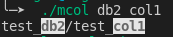

# mcol

easy to to search mongo col

## install

```shell
go get github.com/eaglexiang/mcol
```

## config

create or edit `$HOME/.mcol.confg` with JSON.

sample:

```json
{
    "addr": "127.0.0.1:27017",
    "db": "admin",
    "username": "admin",
    "password": "123456"
}
```

## init cache

run command:

```shell
mcol --cache
```

## search

run command:

```shell
mcol $key0 $key1
```

sample:

```shell
mcol db2 col1
```

output:



> keys found will be highlighted.
